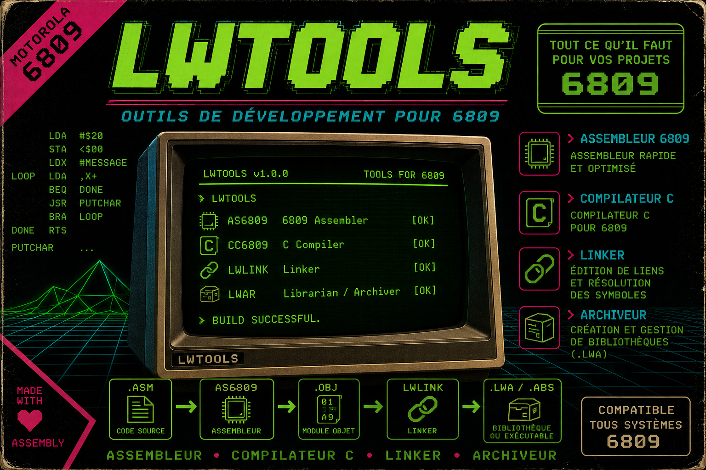

# LWTOOLS - Assembler, Linker, Archiver for M6809 Microprocessor

---

LWTOOLS is a cross development system targeting the 6809 CPU. It consists of an assembler (lwasm), a linker (lwlink), and an archiver (lwar).

## Recent Changes

- Fixed const warnings by changing char pointers to const char pointers in instruction generation and preprocessing files (lwasm/insn_gen.c, lwasm/insn_tfm.c, lwcc/preproc.c).

---
